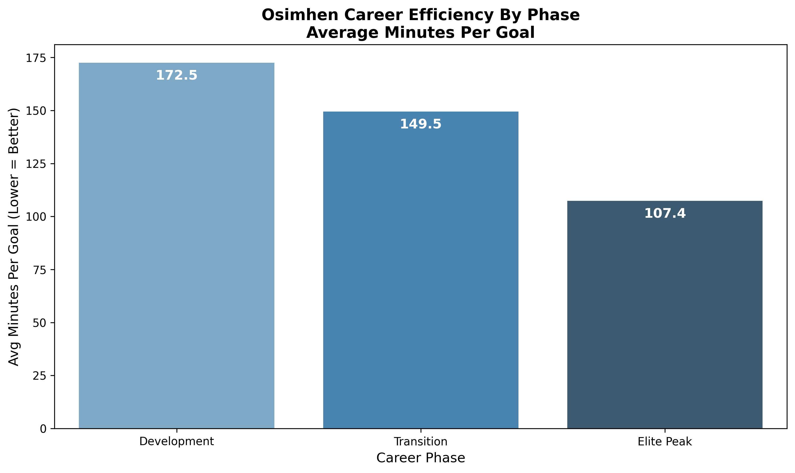
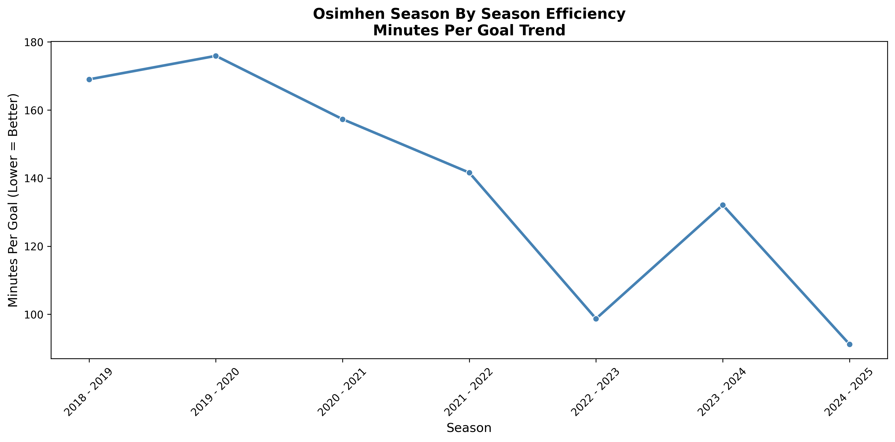
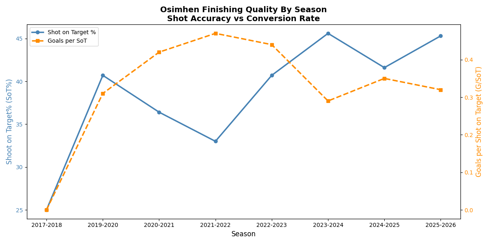

# Victor Osimhen — Career Analytics Dashboard

## Overview
Victor Osimhen is one of the most debated footballers in Nigeria, but how much of that debate is actually backed by data?

This project analyses Osimhen's domestic league career across 10 seasons and 5 clubs using data sourced from FBref.com. Rather than 
relying on opinions, the goal was to let the numbers tell the story.

## Key Findings

**Finding 1 — Three Distinct Career Phases**
His career shows three measurable efficiency phases: Development, Transition and Elite Peak, with scoring efficiency improving by 
65 minutes per goal from start to peak.

**Finding 2 — The Bounce-Back Pattern**
Every relatively quiet season in Osimhen's career has been followed by his best-ever output the following season. Not once, but twice.

**Finding 3 — Improving Technical Quality**
His shot accuracy has risen from 25% to above 45% over his career, directly challenging the narrative that he has technical weaknesses.

## Tools Used
Python — pandas, matplotlib, seaborn
Microsoft Power BI
Microsoft Excel
Data Source: FBref.com

## Project Structure
data/ — raw and cleaned datasets
charts/ — exported visualisations
analysis/ — Python script

## Dashboard Preview

## Data Caveat
All statistics cover domestic league appearances only. Cup, Champions League and international appearances are excluded.

*Analysis by Abdulkadri Ridwan*
*Data Source: FBref.com*
